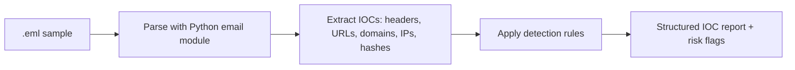
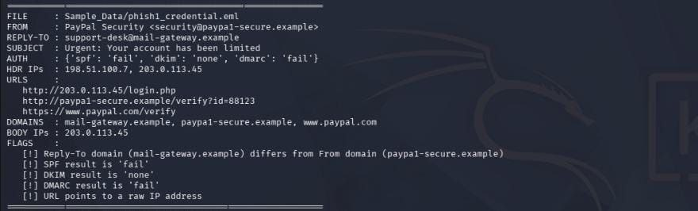
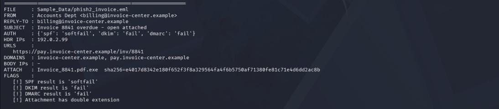
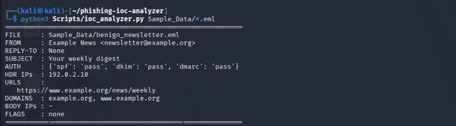

<div align="center">

# 🛡️ Phishing Email & IOC Analyzer

**A Python tool that dissects suspicious emails, extracts Indicators of Compromise (IOCs), and flags phishing red signs in seconds.**


</div>

---

## 📌 Overview

Phishing is one of the most common ways attackers get into organizations. This tool automates the first step of phishing triage: it parses raw `.eml` files, extracts the indicators an analyst would collect by hand, and raises flags for suspicious behavior.

Built as part of my **CYMANABU Cybersecurity Internship**.

> ⚠️ **Safety:** Only synthetic sample emails are used. No real or confidential emails are included. Domains use the reserved `.example` TLD and IPs use documentation ranges.

## ✨ Features

| Capability | Details |
|---|---|
| 📨 Header analysis | Extracts From, Reply-To, Subject and Received-header IPs |
| 🔐 Authentication checks | Reads SPF, DKIM and DMARC results |
| 🔗 URL and domain extraction | Pulls every URL and unique domain from the email body |
| 🌐 IP extraction | Finds IPs in headers and body, and flags links pointing to raw IPs |
| 📎 Attachment analysis | Computes SHA-256 hashes and detects double-extension tricks (e.g. `.pdf.exe`) |
| 🚩 Risk flags | Reply-To mismatch, auth failures, raw-IP URLs, suspicious attachments |

## 🏗️ How It Works



## 🧰 Tools Used

Python · `email` · `re` · `hashlib` · Kali Linux · MITRE ATT&CK

## 🚀 Usage

```bash
git clone https://github.com/mehrunisha1011/phishing-ioc-analyzer.git
cd phishing-ioc-analyzer

# generate the synthetic sample emails
python3 Scripts/make_samples.py

# analyze one email
python3 Scripts/ioc_analyzer.py Sample_Data/phish1_credential.eml

# analyze all samples and save a report
python3 Scripts/ioc_analyzer.py Sample_Data/*.eml > Documentation/ioc_report.txt
```

## 🖼️ Demo

### 🔴 Credential phishing email


### 🔴 Malicious invoice email


### 🟢 Legitimate newsletter


## 💻 Sample Output

<details>
<summary><b>Click to see the analyzer catch a phishing email</b></summary>

```
FILE     : Sample_Data/phish1_credential.eml
FROM     : PayPal Security <security@paypa1-secure.example>
REPLY-TO : support-desk@mail-gateway.example
AUTH     : {'spf': 'fail', 'dkim': 'none', 'dmarc': 'fail'}
URLS     : http://203.0.113.45/login.php
FLAGS    :
   [!] Reply-To domain differs from From domain
   [!] SPF result is 'fail'
   [!] DKIM result is 'none'
   [!] DMARC result is 'fail'
   [!] URL points to a raw IP address
```

</details>

## 🧪 Detection Rules

| Rule | Why it matters |
|---|---|
| Reply-To domain ≠ From domain | Attackers redirect replies to a mailbox they control |
| SPF / DKIM / DMARC fail | Sender is not authorized to send for that domain |
| URL uses a raw IP address | Legitimate brands link to domain names, not IPs |
| Double-extension attachment | `.pdf.exe` disguises an executable as a document |

## 🔎 Findings

| Sample | Verdict | Key indicators |
|---|---|---|
| `phish1_credential.eml` | 🔴 Malicious (credential phishing) | Look-alike domain `paypa1-secure.example` (digit 1 instead of letter l), Reply-To differs from From, SPF fail, DKIM none, DMARC fail, link to a raw IP (203.0.113.45) |
| `phish2_invoice.eml` | 🔴 Malicious (malware delivery) | Attachment `Invoice_8841.pdf.exe` (double extension), SPF softfail, DKIM fail, DMARC fail |
| `benign_newsletter.eml` | 🟢 Legitimate | SPF, DKIM and DMARC all pass, no flags |

### Extracted IOCs
- **IPs:** `203.0.113.45`, `198.51.100.7`, `192.0.2.99`
- **Domains:** `paypa1-secure.example`, `mail-gateway.example`, `invoice-center.example`
- **Attachment SHA-256:** `e4017d8342e180f652f3f8a329564fa4f6b5750af71380fe81c71e4d6dd2ac8b`

## 🎯 MITRE ATT&CK Mapping

| Technique | ID | Seen in |
|---|---|---|
| Phishing: Spearphishing Link | T1566.002 | phish1 |
| Phishing: Spearphishing Attachment | T1566.001 | phish2 |
| Masquerading: Double File Extension | T1036.007 | phish2 |

## 🛠️ Remediation Recommendations

- Block the listed domains and IPs at the mail gateway and firewall
- Quarantine emails with double-extension or executable attachments
- Enforce a DMARC `reject` policy for the organization's own domain
- Train users to check sender domains, Reply-To addresses and link destinations

## 📁 Repository Structure

```
phishing-ioc-analyzer/
├── README.md
├── Scripts/
│   ├── ioc_analyzer.py     # main IOC extraction and analysis tool
│   └── make_samples.py     # generates synthetic sample emails
├── Sample_Data/            # synthetic phishing and benign emails
├── Documentation/          # generated IOC report
└── ss1.jpg, ss2.jpg, ss3.jpg   # screenshots of tool output
```

## 🧠 Lessons Learned

- Email headers carry most of the evidence: mismatches between From and Reply-To, and failed SPF/DKIM/DMARC, are strong signals on their own.
- Look-alike domains (`paypa1` vs `paypal`) are easy for a human to miss, so automating checks matters.
- Scanner-style output still needs analyst judgment: every flag should be verified.

## 🔮 Future Improvements

- Typosquatting / look-alike domain detection
- VirusTotal API enrichment for domains, IPs and hashes
- CLI options, JSON/CSV export, and a Streamlit web interface

---

<div align="center">

**Built by Mehrunisha** · Cybersecurity Intern at CYMANABU

</div>
